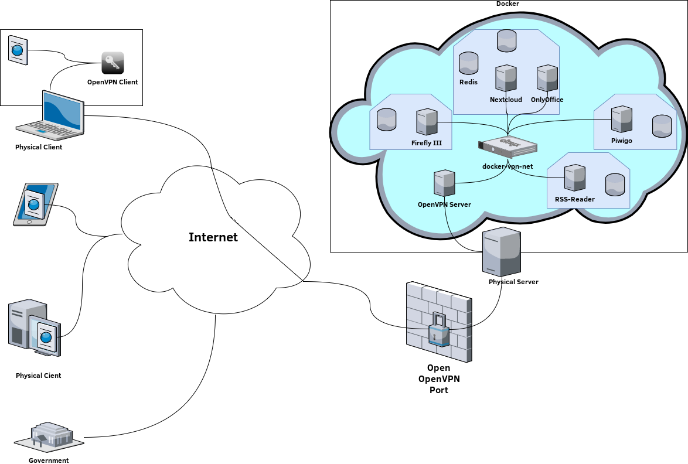

# Project "Adrestia: Your revolt against non-free cloud services"

## Description
Improve your life with Adrestia. We want to introduce to you Adrestia.\
Adrestia provides you with an Ansible script that automatically sets\
up your own cloud on your own server. If you've never heard of Ansible,\
don't worry. We will explain it to you later on.

First of all imagine you have a server somewhere. And on this server\
you want to store maybe your photos, your movies, your financial data,\
your music and so on. But you dont know how to set this all up.\
That's where Adrestia comes in. Adrestia does that all for you automatically.\
So you only need to run the Ansible script provided by Adrestia and there you go.\
Many different applications are available to you afterwards. These are stored\
on your server and only accessible through you over a VPN. No access by third parties.\
Only through you and the people you want to give access to.

You want to know more? Keep reading :D

## Persona
Which person is Adrestia made for? Let us look at an example.\
Julia is a 27 year old women, who works in management at a medium\
sized company. She is digitally native (e.g. can handle a computer),\
but has no direct experience with programming or for example setting up a server.

On a normal working day Julia wakes up at 6 am. She has breakfast and then reads\
the news online. Afterwards Julia goes to work at 7 am, which ends at 4 pm.\
After work Julia goes shopping. She checks her current budget in advance\
with a finance app to estimate how much she will buy. Then Julia goes home\
and has dinner at 5:15 pm. During dinner Julia looks at her last made photos\
about food on her mobile phone. At 6:15 she rides out on her own horse and\
tracks where she rides. Before going to bed, she watches a movie on Netflix\
at 8am and does yoga with music at 10am.

What can we learn from this example? Julia uses various applications from\
different providers throughout her everyday life. She thus passes on her\
data to strangers. Exactly this is what you want to change with Adrestia now.

Here is a brief overview of the above details about Julia:\
Name: Julia\
Age: 27\
Job: Management (digital native but no experience with IT)\
Family status: single\
Hobbies: Netflix, hiking, horse riding, Food-Porn, listening to music

Example of a working day of Julia:\
6 am	wake up\
6:30 am	breakfast and online news\
7 am	start of work\
4 pm	end of work\
4:15 pm	check budget with a finance app and go shopping\
5:15 pm	dinner and Food-Porn\
6:15 pm	riding with own horse and tracking where she rides\
8 pm	watch movie on Netflix\
10 pm	Yoga with music

## Architecture

## Basics

## Notes

### Minimal Version
* modular
* minimal NextCloud
* docker
* Office (NextCloud Connection)
* SecureConnection -> OpenVPN

* Caddy or Traeffik Proxy/Domain?
* Backups of Containers via mounting and backup software on well-known mount location

### Optional Features
* Startpage
* Monitoring Page
* Financial Manager		    -> FireflyIII or app.financier.io
* Photosoftware			    -> Pivigo 
* Media Streaming Software	-> plex 
* Music Player
* Git-Server			    -> Gitlab or Gitea 
* RSS-Reader 			    -> to read and subscribe NewsFeeds
* Webmail-Client		    -> roundcube (-> opensource webmail software which connects with my secure email)
* Backups
* Read-it-later
* Mindmap Software
* Bitwarden (needs individual Licensing Key (which is free but still...), also needs HTTPS and Domain, so nope)
    * Bitwarden-rs lightweight server implementation?

### Commands

* getent hosts <domain>

