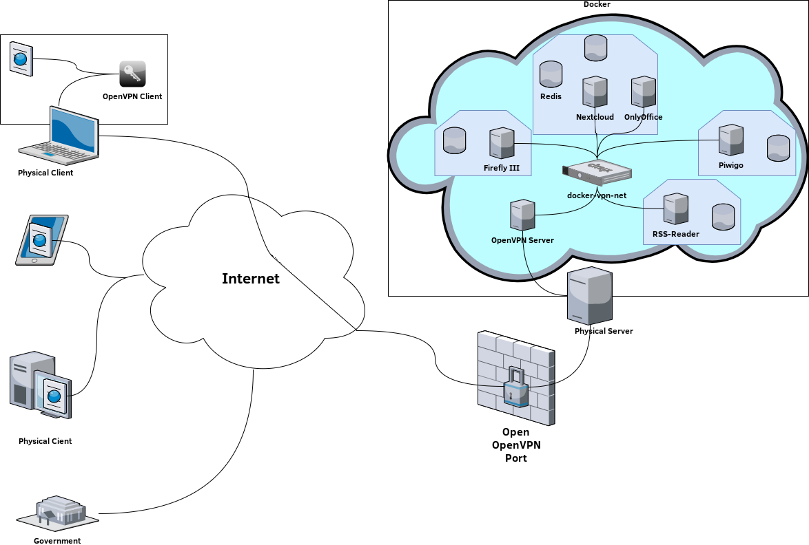

# About Adrestia

## Architecture

The following picture shows the architecture of Adrestia.



As you can see, various parties are involved in Adrestia. On the left side of this picture you can see different physical systems. Imagine that the computer on the top left is your own computer. To use Adrestia, you need an OpenVPN client on your computer. I.e. a program with which you can access your server later, when Adrestia has configured your server for you. Adrestia creates a Virtual Private Network \(VPN\) connection to your server for you, which you can then use with the OpenVPN client. Your server is only accessible through this VPN connection. All other physical systems you see in the picture on the left cannot access your server over the Internet, because they cannot use the VPN connection you have with the server. On the server shown in the picture on the right, Adrestia creates several Docker Containers that are connected via the Docker network. In each of these Docker Containers runs a specific service which you can use. Which services you can use is covered in the following section "Features of Adrestia". Besides the containers for the services, an OpenVPN server is required on the server. This server also runs in an own container of Docker. The OpenVPN server is necessary for the VPN connection. It is the counterpart of the OpenVPN client on your computer, so to speak.

## Features of Adrestia

This section describes what Adrestia contains. Thereby a distinction is made between a minimal version and optional features for Adrestia.  The minimum version of Adrestia contains the following:

* Automatic creation of a VPN connection to the server
* Securing the server so that it is only accessible via VPN
* Installation of Docker and Docker Compose on the server
* Creation of the following services each in a Docker container with a database:
  * NextCloud with OnlyOffice = a software to store, manage and edit your files with OnlyOffice. OnlyOffice allows you to edit your files similar to Word, Excel or Powerpoint from Microsoft.
  * Piwigo Photosoftware = a software to manage your photos
  * Firefly III = a software to manage your finances

Besides the minimal version it is also planned to add the following optional features to Adrestia:

* A home page that contains links to all services
* Automatic backups of the services
* Creation of the following services each in a Docker container with a database:
  * Bitwarden = a service to manage any passwords you have
  * RSS-Reader
  * WebMail Client
  * Monitoring
  * Mindmap Software
  * Git-Server
  * Media-Streaming
  * Portainer
  * LDAP Server for automatic login configuration on all supported services
* An installation program

## Structure

The structure of the project of Adrestia consists of several folders and files. If you are interested in what each of these folders and files is for and what the individual commands in the files mean, this section will give you answers. The following picture shows the folder structure of the project of Adrestia.

Bild von Ordnerstruktur

Here are the files that Adrestia will use later to configure your server with Ansible. Let's first look at the files and folders at the top of the folder structure. This includes the following three files and four folders:

### ansible.cfg

This file contains the configuration of Ansible. This means that Ansible can, for example, use this file to determine where information about your server is stored that Ansible should use. If you look at this file, you will see that it contains many lines of text. If there is a hash character \(\#\) in front of a line, then this line is considered a comment by Ansible and will not be used by Ansible later. Generally, this file contains many hash characters. Depending on what you want to do with Ansible, Ansible gives you the possibility to set different things through this file. For Adrestia only one line of the whole file is needed. If you want, you can search for the line that has no hash character in front. :D  It's the following line:

```text
inventory = ./config/hosts.yaml
```

This line tells Ansible that the file where Ansible can find information about your server or other systems that Ansible should configure can be found in ./config/hosts.yaml. More precisely in the config folder and there in the hosts.yaml file. We will discuss the hosts.yaml file separately later.

### tasks.md

The file tasks.md is a to-do list for us who have developed Adrestia, where we mark what has already been added to Adrestia and to see what is still missing.

### LICENSE

The LICENSE file contains the licence conditions for using Adrestia. This means that there are conditions in there that you must comply with when using Adrestia.

### config

The config folder contains the following three files:

defaults.yml

hosts.yml

user. yml

### docs

images

### playbooks

adrestia.yml

bootstrap-python.yml

roles  
-&gt; docker-host  
-&gt; openvpn  
-&gt; harden  
-&gt; fireflyiii  
-&gt; nextcloud  
-&gt; piwigo  
-&gt; update

### services

fireflyiii

piwigo

nextcloud

